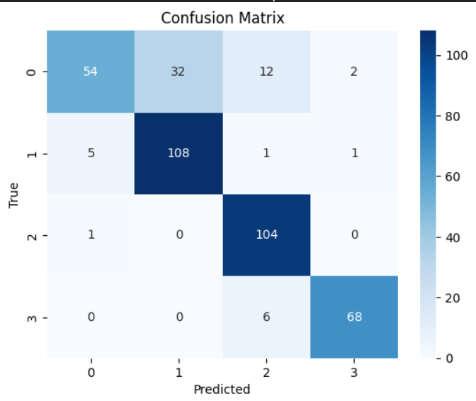
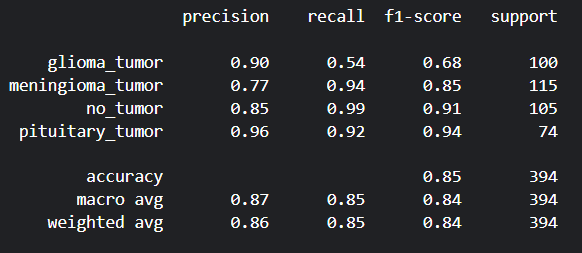
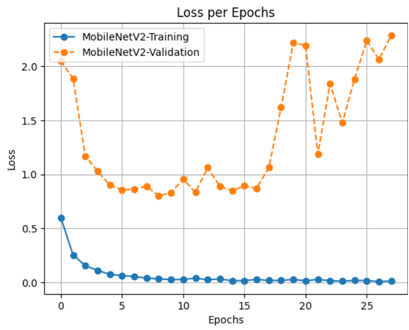
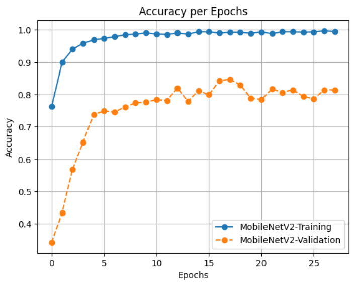
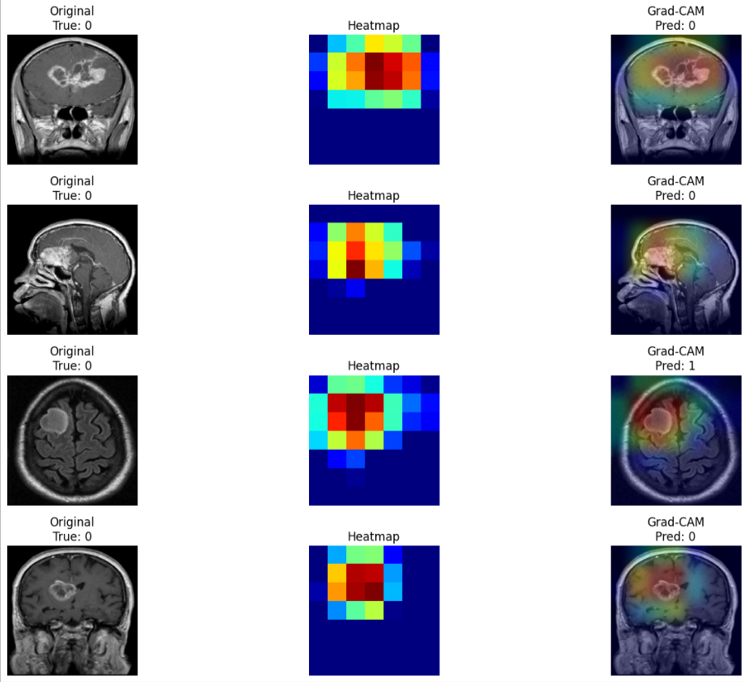

# 🧠 Brain Tumor Classification using MobileNetV2

This project applies deep learning techniques to classify brain tumors from MRI images into four categories glioma_tumor, meningioma_tumor, no_tumor, and pituitary_tumor 
using MobileNetV2 with transfer learning, fine-tuning, and visualization via Grad-CAM.

## 📌 Project Overview

Brain tumor detection and classification from MRI scans is crucial for early diagnosis and treatment planning.

This project leverages MobileNetV2, a lightweight yet powerful CNN architecture, combined with:

  - Data augmentation for robustness
  - Class weights to handle imbalance
  - Transfer learning for efficiency
  - Grad-CAM for interpretability

## 📂 Dataset

The dataset is from [Brain Tumor Classification (MRI) on Kaggle](https://www.kaggle.com/datasets/sartajbhuvaji/brain-tumor-classification-mri).
  - Training set: /Training
  - Testing set: /Testing
  - Classes:
    - Glioma Tumor
    - Meningioma Tumor
    - No Tumor
    - Pituitary Tumor

## 🚀 Model Architecture

  - Backbone: MobileNetV2 (pre-trained on ImageNet)
  - Custom Head:
    - Global Average Pooling
    - Dense (512, ReLU) + Dropout (0.3)
    - Dense (4, Softmax) for classification

## 🏋️ Training
  
  - Image Preprocessing:
    - Rescale 1./255
    - Random flips, shear, zoom
  - Loss Function: Categorical Crossentropy
  - Optimizer: Adam (lr=0.0001)
  - Regularization: Dropout (0.3) + class weights
  - Callbacks: EarlyStopping, ModelCheckpoint

## 📊 Results

  - Test Accuracy: ~84.77%
  - Test Loss: 1.0631

    
 **Confusion Matrix** 
 

 **Classification Report** 
 

#### 📈 Training Curves

 **Loss Per Epochs** 
 

 **Accuracy Per Epochs** 
 

## 🔍 Explainability with Grad-CAM

Grad-CAM visualizations highlight tumor regions influencing the model’s decision.

Pipeline: Extract gradients from last convolutional layer. Generate class activation heatmap. Overlay heatmap on original image.

 **Grad-Cam Results** 
 

## 📌 Future Improvements

  - Use larger backbones (EfficientNet, ResNet50)
  - Apply advanced augmentations (MixUp, CutMix)
  - Deploy as a web app for real-time predictions

    
